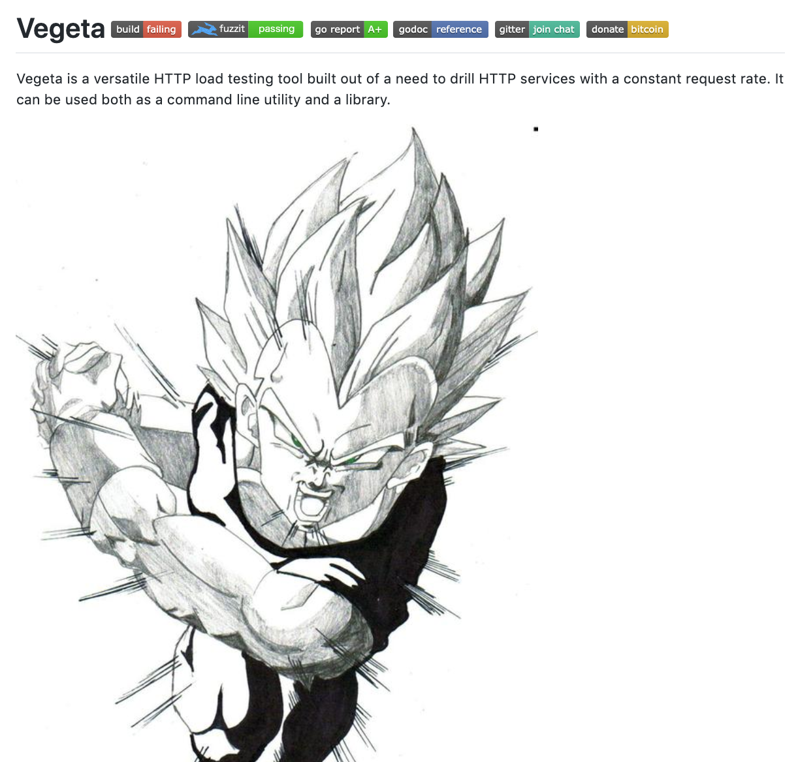
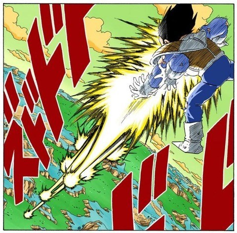
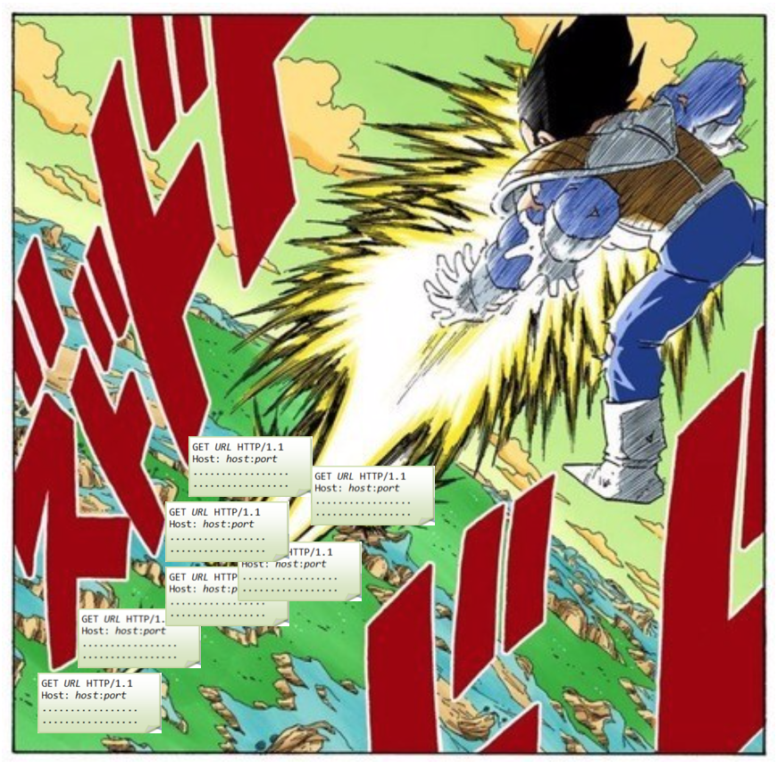
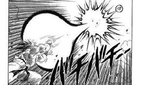
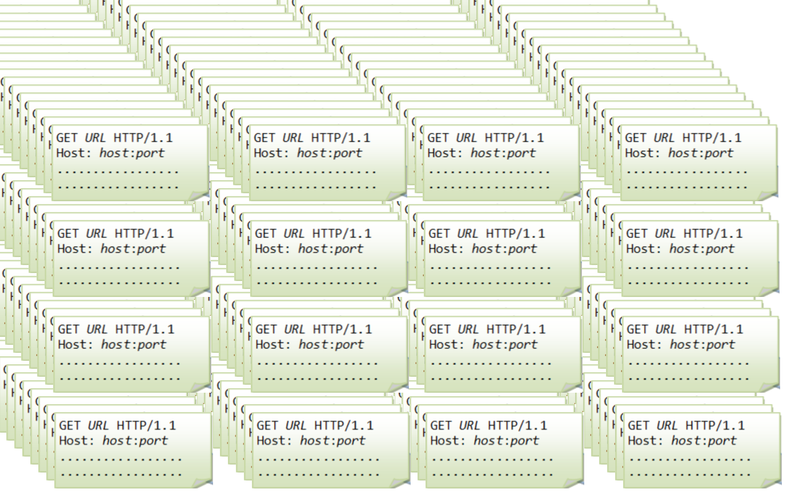

## ベンチマークについての話

SUSHI LIGHTNIG by Hack'z Vol.2

---

## About me

name:      nasa

about me:   k-nasa.me

Note:
- 5分しかないので２秒で終わらせる

---

### ココで言うベンチマーク

ベンチマーク、ベンチマーカーはおんなじ意味とします

HTTPサーバーにリクエストを投げて負荷試験を行えるツールとします。

---

### 11月初日

vegataというgolangで書かれたベンチマーカーがあるという噂を聞いた。

---

#### vegeta

https://github.com/tsenart/vegeta



---

### vegeta

このコマンドで負荷試験を実行できる。

```
vegeta attack -rate 5000 -duration 10m
```

---

イメージこういうこと？

ベジ○タの放つ一発一発がHTTP リクエストである。



---

つまりこう



---

そこで考えたわけです


---

かめはめ波の方が絶対リクエストを送っている！



---

かめはめ波を顕微鏡で見るとこうなっている



※  誰も調べてない
