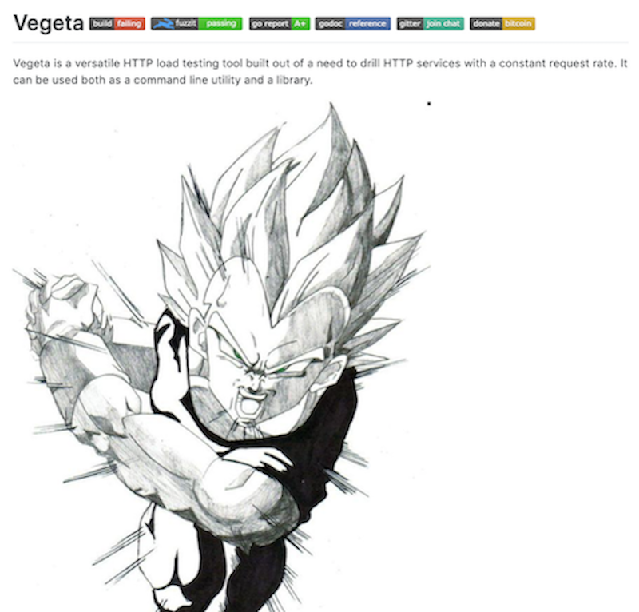
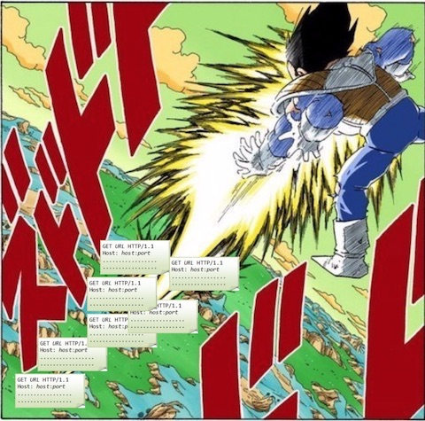

## かめはめ波はHTTPリクエストの集合体だった!?

SUSHI LIGHTNIG by Hack'z Vol.2

---

## About me

name:      nasa

about me:   k-nasa.me

Note:
- 5分しかないので２秒で終わらせる

---

### ココで言うベンチマーク

ベンチマーク、ベンチマーカーはおんなじ意味とします

HTTPサーバーにリクエストを投げて負荷試験を行えるツールとします。

---

### 11月初日

vegataというgolangで書かれたベンチマーカーがあるという噂を聞いた。

---

#### vegeta

https://github.com/tsenart/vegeta



---

### vegeta

このコマンドで負荷試験を実行できる。

```
vegeta attack -rate 5000 -duration 10m
```

---

イメージこういうこと？

ベジ○タの放つ一発一発がHTTP リクエストである。


---

つまりこう



---

そこで考えたわけです


---

かめはめ波の方が絶対リクエストを送っている！


---

かめはめ波を顕微鏡で見るとこうなっている


※  誰も調べてない

---

ということで再現ツールを作りました。

https://github.com/k-nasa/goku


---

コマンドはこんな感じ。

中身の話はRustの話になってしまうので省略
(懇親会のときでも聞いてください)

```
goku kamehameha -c 10 -n 10000 'http://127.0.0.1:8080'
# or goku attack -c 10 -n 10000 'http://127.0.0.1:8080'
```

---

ドラゴンボ○ルと同じく、初期状態ではGokuはVegetaに負けている。

これからパワーアップしていくので応援してください。

展望としては、負荷レベルが徐々に上がっていく界王拳コマンド、複数のURLに送れるようなシナリオ定義を実装する

---

## ここから話は変わって、コマンドラインツールのリリースの話

時間がなければココで終わり!

今何分ですか？

---

CLIツールのリリースどうしてますか？


CLIツールリリースで考えること

- 複数OSに対応した実行ファイル
- インストールのしやすさ

---

GitHub releaseにバイナリをアップロード!

製作者の面倒くさと, 利用者のインストールの楽さを取ったらこれが良い気がした。(諸説ありGitHub releaseにバイナリをアップロード)

```
curl -L -o goku.tar.gz https://github.com/k-nasa/goku/releases/download/0.1.1/goku_x86_64-apple-darwin.tar.gz
tar -zxvf goku.tar.gz
# pathが通っているところに配置
```

---

クロスコンパイルは割と楽にできるけど(言語による)

「zipで固めて、アップロード」とかやると面倒くさい、、、自動化したい


---

ということでツールを作りました。part2

https://github.com/k-nasa/rgh


---

コマンドの例

環境変数のGITHUB_TOKENを見てる。
ローカルの.git/ からリポジトリのownerと名前を取得している

オプションでの指定も可能

```
rgh "ベジータ〜。今回のリリースはすっげぇぞ！" package_dir/
```

---

今週作ったツールの紹介で終わってしまいましたが、、、

ご成長ありがとうございました！


